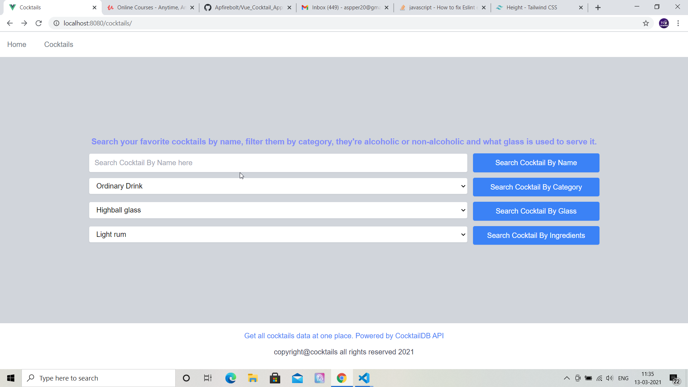
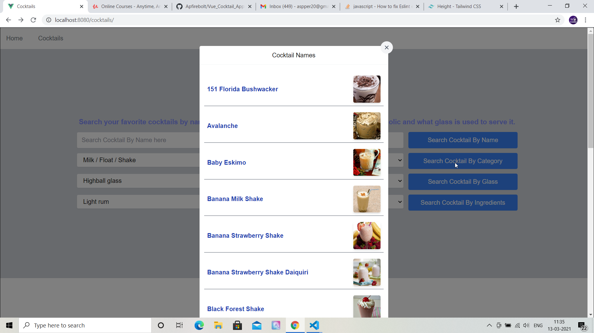
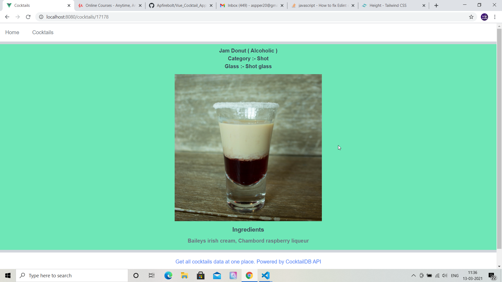
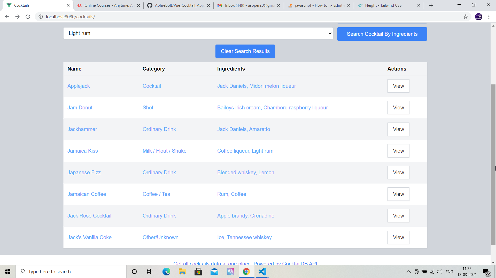

# VueCocktails - Cocktails database app using Vue

## Project Briefing

This is a cocktails database app created in Vue 2 powered by tailwind css and vue-tailwind package. This app using data from the Cocktail Database API. Here is the link of their open source API. https://www.thecocktaildb.com/api.php. Please support them, in my knowledge it's one of the easiest APIs to use with no authentication. 

This app would have information related to tons of delicious cocktails around the globe including their ingredients, whether they're alcoholic in nature or not and what glass they're served in.

## Built With

* [Vue JS](https://vuejs.org/)
* [TailwindCSS](https://tailwindcss.com/)
* [Vue-tailwind](https://www.vue-tailwind.com/)

## Authors

* **Amit Prafulla (APFirebolt)** - (http://amitprafull.com/)
## Project setup
This should be a piece of cake for you if you have worked under npm environment before. Simply initialize an empty project using 'npm init' and then install packages. Simply clone the project and install dependencies.
```
npm install
npm run serve
```
### Compiles and minifies for production
```
npm run build
```

### Lints and fixes files
```
npm run lint
```
## Project Screenshots

Please find some of the screenshots of the application. First screenshot depicts the cocktails page of the application with a search form where you can search cocktails through name, category, glass and ingredients.



This shows cocktail names list in form of a modal when filtering is applied based on ingredients, glass or category. Clicking on the image would direct you to the details page of that specific cocktail.



This screenshot shows the detail of the cocktail page. On the details page, you'd find the image, ingredients used, name and other information about the cocktail in consideration.



This shows results of cocktails fetched when search is performed based on the cocktail name. The result is displayed in tabular form using vue-tailwind tables.

